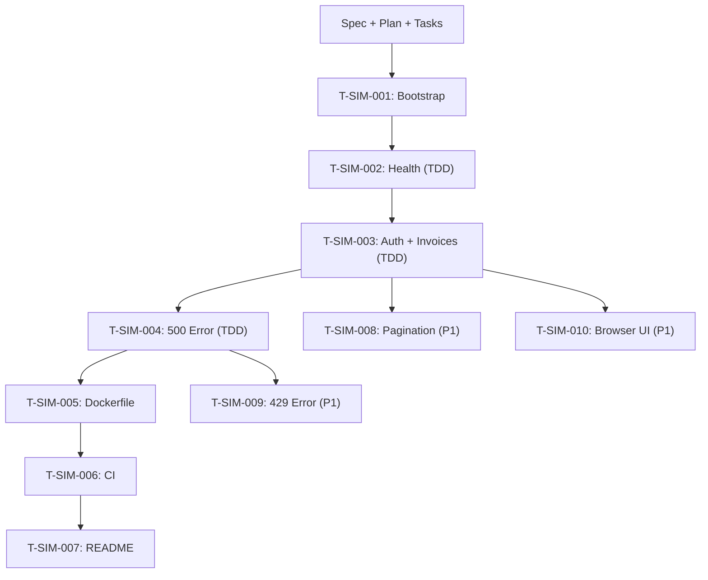

# Task List — Sage Provider Simulator v0.1.0

**Version:** 0.1.0
**Status:** Draft
**Date:** 2026-09-08
**Specification:** [spec.md](spec.md)
**Plan:** [plan.md](plan.md)
**Constitution:** [constitution.md](../../.specify/memory/constitution.md)

> **Scope:** This task list contains ONLY tasks for the `sage-provider-simulator`
> repository. All tasks follow test-first development for core behavior.

---

## Task Status Legend

| Symbol | Status |
|---|---|
| ⬜ | Not started |
| 🔄 | In progress |
| ✅ | Complete |
| ❌ | Blocked |

---

## P0 — Core Simulator

### T-SIM-001: Project Bootstrap

- **Status:** ⬜
- **Priority:** P0
- **Branch:** `feature/flask-health`
- **Dependencies:** Spec and plan approved.
- **Description:** Initialize Python project structure with Flask application
  factory, pyproject.toml (Ruff config), requirements.txt, .env.example,
  and .gitignore.
- **Deliverables:**
  - `app/__init__.py` (create_app factory, empty)
  - `app/config.py`
  - `requirements.txt`
  - `pyproject.toml`
  - `.env.example`
  - `.gitignore`
- **Acceptance Criteria:**
  - [ ] `create_app()` returns a Flask instance.
  - [ ] `ruff check .` passes with no errors.
  - [ ] `.env.example` contains `PROVIDER_API_KEY` placeholder.
  - [ ] No secrets in any file.
- **Traces to:** FR-209, NFR-SIM-002

---

### T-SIM-002: Health Endpoint (Test-First)

- **Status:** ⬜
- **Priority:** P0
- **Branch:** `feature/flask-health`
- **Dependencies:** T-SIM-001.
- **Description:** Write tests for `GET /health`, then implement the endpoint.
- **Deliverables:**
  - `tests/test_health.py`
  - `tests/conftest.py`
  - `app/blueprints/health.py`
- **Acceptance Criteria:**
  - [ ] Tests written before implementation (red → green).
  - [ ] `GET /health` returns `200 {"status": "ok"}`.
  - [ ] No authentication required.
  - [ ] All tests pass.
- **Traces to:** FR-207, AC-SIM-001

---

### T-SIM-003: Authentication and Invoice Endpoint (Test-First)

- **Status:** ⬜
- **Priority:** P0
- **Branch:** `feature/flask-invoices`
- **Dependencies:** T-SIM-002.
- **Description:** Write auth and invoice tests, then implement X-API-Key
  decorator, fixture loading, and `GET /api/v1/invoices` endpoint.
- **Deliverables:**
  - `tests/test_auth.py`
  - `tests/test_invoices.py`
  - `app/auth.py`
  - `app/blueprints/invoices.py`
  - `fixtures/invoices.json`
- **Acceptance Criteria:**
  - [ ] Tests written before implementation (red → green).
  - [ ] 401 returned without X-API-Key.
  - [ ] 401 returned with invalid X-API-Key.
  - [ ] 200 returned with valid X-API-Key and fixture invoices.
  - [ ] Response schema matches provider API contract.
  - [ ] At least 3 fixture invoices with distinct values.
  - [ ] `GET /health` remains unauthenticated.
- **Traces to:** FR-201, FR-202, FR-208, AC-SIM-002, AC-SIM-003

---

### T-SIM-004: Simulated 500 Error (Test-First)

- **Status:** ⬜
- **Priority:** P0
- **Branch:** `feature/flask-invoices` (bundled with T-SIM-003)
- **Dependencies:** T-SIM-003.
- **Description:** Write 500 error tests, then implement the
  `?simulate_error=500` trigger.
- **Deliverables:**
  - `tests/test_errors.py`
  - Error handling in `app/blueprints/invoices.py`
  - `app/errors.py`
- **Acceptance Criteria:**
  - [ ] Tests written before implementation (red → green).
  - [ ] `GET /api/v1/invoices?simulate_error=500` with valid key returns 500.
  - [ ] Response is structured JSON with error message.
  - [ ] Normal requests (without `simulate_error`) still return 200.
- **Traces to:** FR-205, FR-208, AC-SIM-004

---

### T-SIM-005: Dockerfile

- **Status:** ⬜
- **Priority:** P0
- **Branch:** `feature/dockerfile-ci`
- **Dependencies:** T-SIM-004.
- **Description:** Create Dockerfile that builds a runnable image.
- **Deliverables:**
  - `Dockerfile`
- **Acceptance Criteria:**
  - [ ] `docker build` succeeds.
  - [ ] Container starts and `GET /health` returns 200.
  - [ ] Uses `python:3.12-slim` base image.
  - [ ] No secrets baked into the image.
- **Traces to:** FR-210, AC-SIM-005

---

### T-SIM-006: CI Workflow

- **Status:** ⬜
- **Priority:** P0
- **Branch:** `feature/dockerfile-ci` (bundled with T-SIM-005)
- **Dependencies:** T-SIM-005.
- **Description:** Create GitHub Actions CI workflow: Ruff, pytest, Docker build.
- **Deliverables:**
  - `.github/workflows/ci.yml`
- **Acceptance Criteria:**
  - [ ] Triggers on push and PR to `develop`.
  - [ ] Runs `ruff check .`.
  - [ ] Runs `pytest -v`.
  - [ ] Runs `docker build`.
  - [ ] All steps pass.
- **Traces to:** FR-211, AC-SIM-005, NFR-SIM-005

---

### T-SIM-007: README

- **Status:** ⬜
- **Priority:** P0
- **Branch:** `feature/dockerfile-ci` (bundled with T-SIM-005)
- **Dependencies:** T-SIM-006.
- **Description:** Create README with project description, setup, usage,
  endpoint reference, and contract link.
- **Deliverables:**
  - `README.md`
- **Acceptance Criteria:**
  - [ ] States this is a local Sage-like portfolio simulator.
  - [ ] Documents all endpoints and auth requirements.
  - [ ] Provides local setup and test instructions.
  - [ ] Links to the provider API contract in `integration-workspace`.
  - [ ] All content in English.
- **Traces to:** NFR-SIM-003, NFR-SIM-004

---

## P1 — Extended Scenarios

### T-SIM-008: Pagination Support

- **Status:** 🔄
- **Priority:** P1
- **Branch:** `feature/p1a-pagination-and-429`
- **Implementation Commit:** `c62b6e9e4ea3ee26478307bbd78089214ba8786f`
- **Dependencies:** T-SIM-003; workspace contract baseline merged into
  `integration-workspace/develop` at `1b481345748f7b66084ade31231d0bf146013c4a`.
- **Description:** Implement `page` and `per_page` query parameter handling
  with defaults, integer validation, duplicate parameter rejection, and pagination
  metadata in response.
- **Implementation Status:** Implemented and locally validated on this branch
  (`pytest -v`: 32 passed; `ruff check .`: passed).
  **Not yet PR-reviewed, merged, or live-E2E-verified.**
- **Remaining Merge Gates:**
  - Simulator PR review;
  - End-to-end Compose verification;
  - Explicit merge approval.
- **Traces to:** FR-203, AC-SIM-006

---

### T-SIM-009: Simulated 429 with Retry-After

- **Status:** 🔄
- **Priority:** P1
- **Branch:** `feature/p1a-pagination-and-429`
- **Implementation Commit:** `c62b6e9e4ea3ee26478307bbd78089214ba8786f`
- **Dependencies:** T-SIM-004; workspace contract baseline merged into
  `integration-workspace/develop` at `1b481345748f7b66084ade31231d0bf146013c4a`.
- **Description:** Implement deterministic `?simulate_error=429` trigger with
  `Retry-After: 5` header and precedence over pagination validation.
- **Implementation Status:** Implemented and locally validated on this branch
  (`pytest -v`: 32 passed; `ruff check .`: passed).
  **Not yet PR-reviewed, merged, or live-E2E-verified.**
- **Remaining Merge Gates:**
  - Simulator PR review;
  - End-to-end Compose verification;
  - Explicit merge approval.
- **Traces to:** FR-204, AC-SIM-007

---

### T-SIM-010: Browser UI

- **Status:** ⬜
- **Priority:** P1
- **Branch:** `feature/simulator-ui`
- **Dependencies:** T-SIM-003.
- **Description:** Implement HTML page at `GET /` showing fixture data and
  simulator status.
- **Traces to:** FR-206, AC-SIM-008

---

## Dependency Graph

---

## Summary

| Priority | Tasks | Status |
|---|---|---|
| **P0** | T-SIM-001, T-SIM-002, T-SIM-003, T-SIM-004, T-SIM-005, T-SIM-006, T-SIM-007 | ⬜ Not started |
| **P1** | T-SIM-008, T-SIM-009 | 🔄 In progress (locally validated) |
| **P1** | T-SIM-010 | ⬜ Not started |
